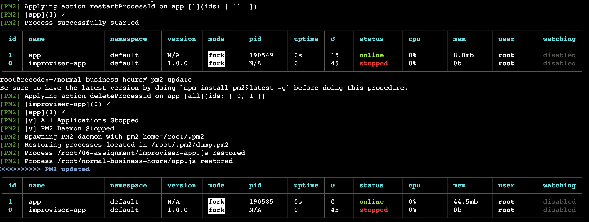
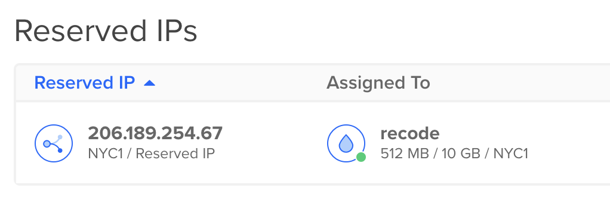

# Normal Business Hours
*Part of an assignment for the ReCode class at NYU's IMA program, Fall 2023.*

## Project Description
Starter code for a website that serves your resume only during your normal business hours. Otherwise, it returns a simple message explaining when potential employers can return to find the information they seek.

## Working Process:

For this assignment, I aim to make a interactive fun webpage with some animations in the denied page.

After looked through several examples online, I found out that using Greensock library is the best choice.

I collected lots of useful references for creating cool html and css with fun animation.

I choose to use the default resume, because of the default one looks good to me.

The great thing about this project setting is that I can create boundaries between different portion of my life.

For example, Study and gaining new skills are my top priority, so I prioritize assignments over other social events.

That is why I let the resume page surf on the internet 9am-5pm.

- Hobbies or personal interests

  Hobbies: Exploring new coffee shops, new stationary stores in the City.

  Personal interests: Figure skating, painting, developing new skills - sign up for courses, doing art and design things...
  
- Are you a morning person?

  Yes! I set the working hours to everyday 9am to 5pm, because this is the best schedule for me who prefer to work during daytimes. Ideally, having a dayoff is great.

### Coding Part:

This is my favorite coding part by add hover state to navigation.

By adding this interaction makes the page more lively and fun.

Also the texts pops up smoothly by utilizing the greensock external library

After designing my denied webpage, I let the folder run through digital ocean using Droplet.

It is running successfully after I download the node, npm, pm2 to the new folder.

I also get a reserved IP address 206.189.254.67:3000

!! It is working :-) !!

I love the overall outcome, and I wish to add scroll function with 3-4 image background to make the page more interactive.

### Challenges:

There are lots of challenges, for example some details of page layout is not very ideal at the beginning.

After changing the margin and padding, the webpage start to looking good.

I tried to add multiple images as background to have more visual effects and compenents on a page.

Sadly, after several attemps I wasn't able to combine scroll function with 3-4 images background on my page.

I also get some advice from chatgpt, I should probably use div element to have multiple section and then add background to each section.

I tried the piece of code that chatgpt generate, but the images are not showing up.

Haven't figured out how to add several images to a page. 

Hopfully, soon!!

Another thing is that I should add ./ before my css and js files. Otherwise, on the digital ocean these two files cannot get access and the page looks like with plain html.

## Credit:

[Helpful CodePen example 1: animation navigation](https://codepen.io/Vishal4225/pen/JjmVZWK)

[Helpful CodePen example 2: animation of the main page and layout](https://codepen.io/nitin-sharma0001/pen/yLZXLXO)

[Helpful CodePen example 3: Text animation](https://codepen.io/StephenScaff/pen/oLBqmw)

[Helpful CodePen example 4: showcase purpose webpage](https://codepen.io/kayfo23/pen/EeqYJw)

[Helpful CodePen example 5: scroll webpage](https://codepen.io/camilasecond/pen/jOLMJvJ)
