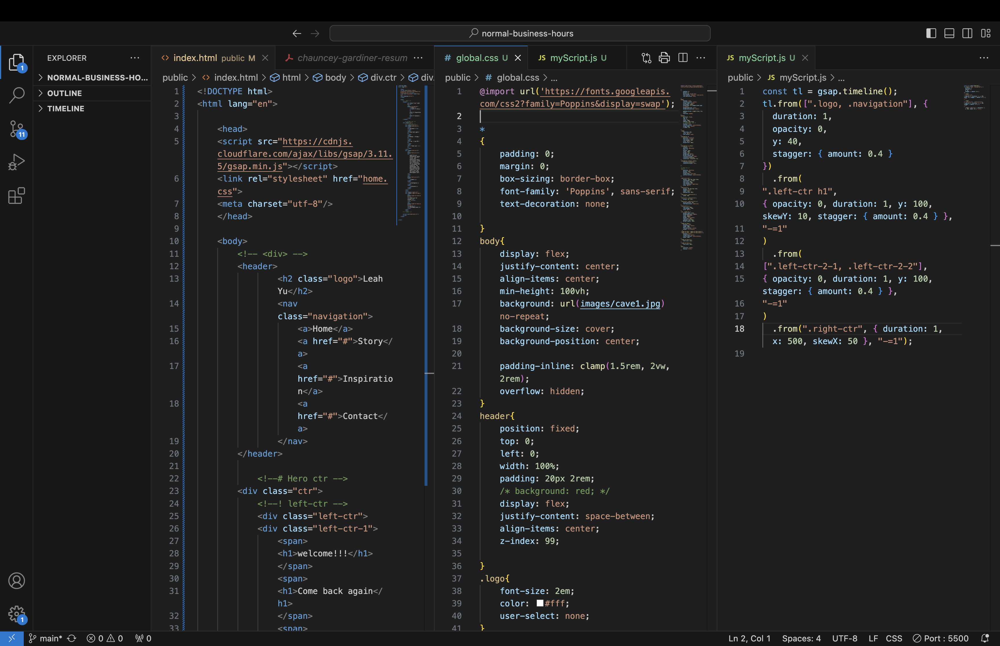

# Normal Business Hours
*Part of an assignment for the ReCode class at NYU's IMA program, Fall 2023.*

## Project Description
Starter code for a website that serves your resume only during your normal business hours. Otherwise, it returns a simple message explaining when potential employers can return to find the information they seek.

## Working Process:

For this assignment, I collected lots of useful references for creating cool html and css with fun animation.

I set the working hours to Every 9am to 5pm.

### Coding Part:

This is my favorite coding part by add hover state to navigation

Also the texts pops up smoothly by utilizing the greensock external library

I love the overall outcome, and I wish to add scroll function with 3-4 image background to make the page more interactive.

Sadly, after several attemps I wasn't able to combine that on my page.

Probably, look into the div element more, haven't figured out yet.

## Credit:

[Helpful CodePen example 1: animation navigation](https://codepen.io/Vishal4225/pen/JjmVZWK)

[Helpful CodePen example 2: animation of the main page and layout](https://codepen.io/nitin-sharma0001/pen/yLZXLXO)

[Helpful CodePen example 3: Text animation](https://codepen.io/StephenScaff/pen/oLBqmw)

[Helpful CodePen example 4: showcase purpose webpage](https://codepen.io/kayfo23/pen/EeqYJw)

[Helpful CodePen example 5: scroll webpage](https://codepen.io/camilasecond/pen/jOLMJvJ)
